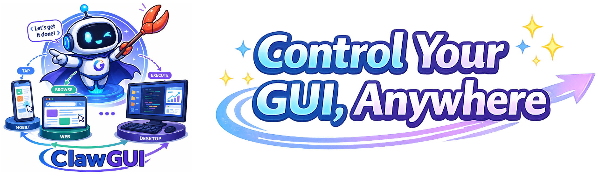

<div align="center">
  
  <h1>ClawGUI — Windows Setup</h1>
  <p>
    
    
    
  </p>
</div>

This repo contains the Windows-ready build of **ClawGUI-master** — a unified framework for training, evaluating, and deploying GUI agents. The primary entry point on a Windows target machine is the **Windows Agent Server (WAS)**, which exposes a REST + MCP interface so a controller can issue tasks and receive screenshots in a closed loop.

---

## Prerequisites

On a **brand-new Windows machine**, open PowerShell as Administrator and run:

```powershell
winget install Python.Python.3.12 Git.Git
```

Close and reopen your terminal after this so `python` and `git` are on PATH. If your machine already has Python 3.11+ and Git, skip this step.

---

## Setup (4 commands)

```powershell
git clone https://github.com/Usil-Cloud/ClawGUI-master-windows.git
cd ClawGUI-master-windows\clawgui-agent
pip install -r requirements_windows.txt && pip install -e . && pip install -e nanobot/
python windows_agent_server.py
```

The server starts on **port 7860** by default.

| Endpoint | URL |
|---|---|
| Web UI / Status | http://localhost:7860 |
| REST API | http://localhost:7860/api/ |
| MCP endpoint | http://localhost:7860/mcp |
| Interactive docs | http://localhost:7860/docs |

---

## Configuration (only needed for standalone mode)

**Smoketest / server-only**: if this machine is acting purely as the Windows Agent Server — receiving tasks from a controller on another machine — you do **not** need an API key here. The controller handles VLM calls.

**Standalone mode**: if you want this machine to also drive the VLM reasoning loop itself, set an API key for whichever provider you're using (OpenRouter, Zhipu AI, a local vLLM server, etc.). These providers all use the OpenAI-compatible API format:

```powershell
# Example: OpenRouter
$env:OPENAI_API_KEY = "sk-or-..."

# Example: local vLLM (no key required — just set the base URL in config)
```

Or add it to a `.env` file inside `clawgui-agent/`:

```
OPENAI_API_KEY=your-provider-key-here
```

See [`clawgui-agent/README.md`](clawgui-agent/README.md) for the full provider/model config reference.

---

## Custom Host / Port

```powershell
python windows_agent_server.py --host 0.0.0.0 --port 8080
```

---

## Pointing a Controller at This Machine

On the controller machine, point the agent server address to:

```
http://<this-machine-ip>:7860
```

Then send tasks from the controller's Web UI (`python webui.py`) or CLI (`python main.py`).

---

## Smoke Test Checklist

- [ ] Server starts without errors
- [ ] `http://localhost:7860/docs` loads in browser
- [ ] `/api/` returns a JSON response
- [ ] Controller can reach `http://<ip>:7860` from the network
- [ ] A test task completes end-to-end (screenshot → action loop)

---

## Full Documentation

See [`clawgui-agent/README.md`](clawgui-agent/README.md) for the complete guide: model configuration, chat platform integrations (Feishu, Telegram, Slack, QQ, and more), memory system, and evaluation pipeline.

---

## License

[Apache License 2.0](LICENSE)
